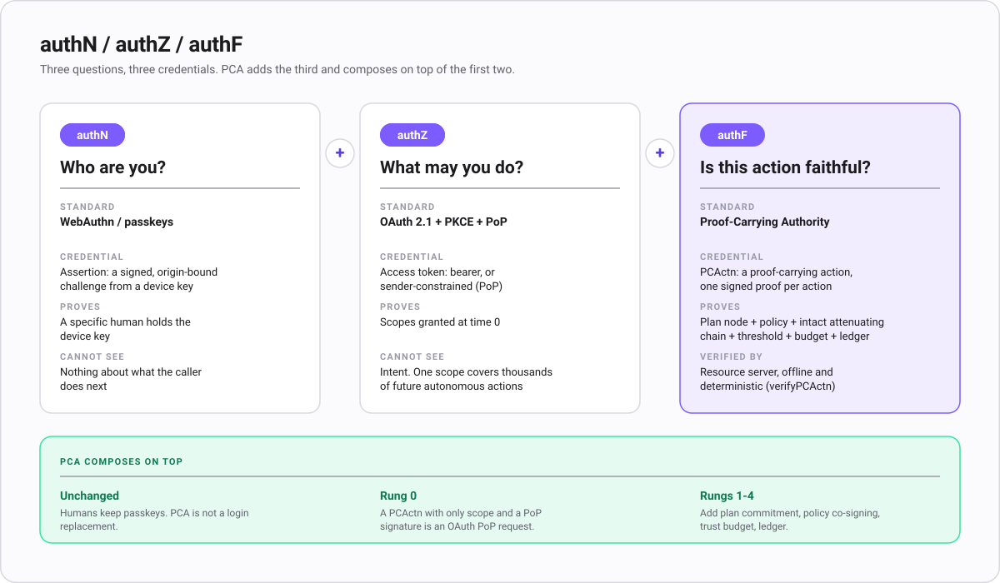
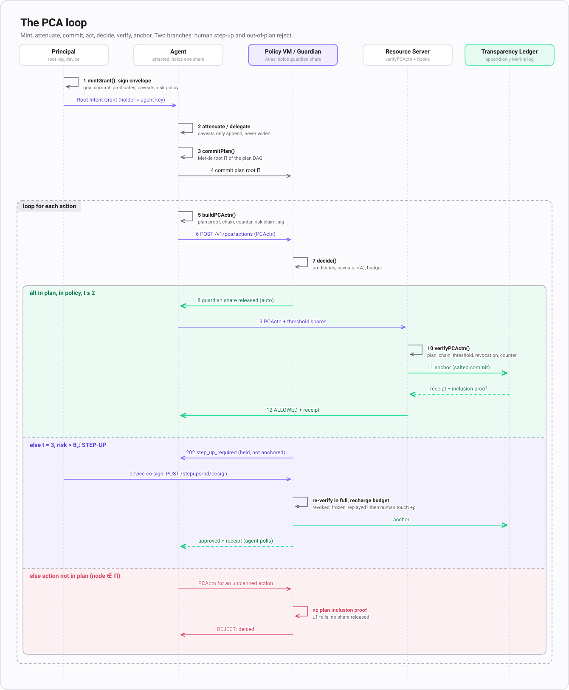
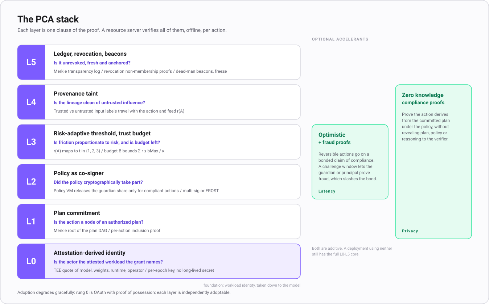
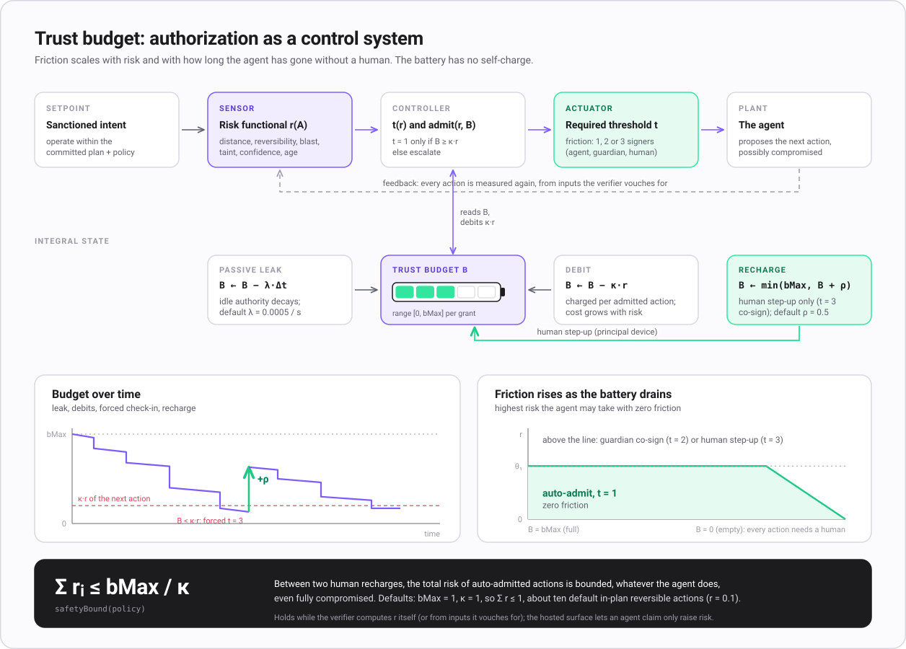
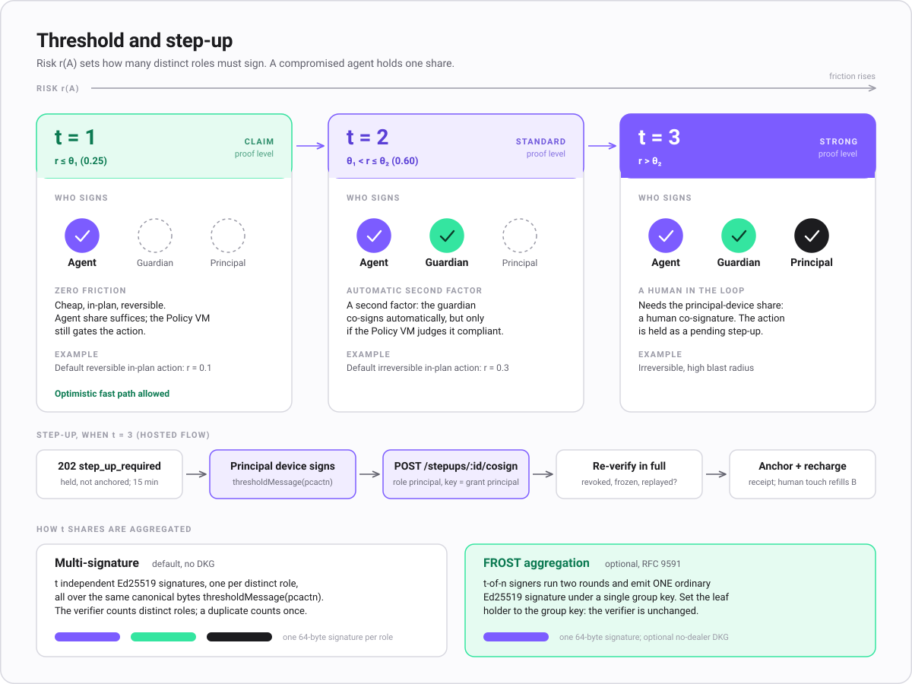
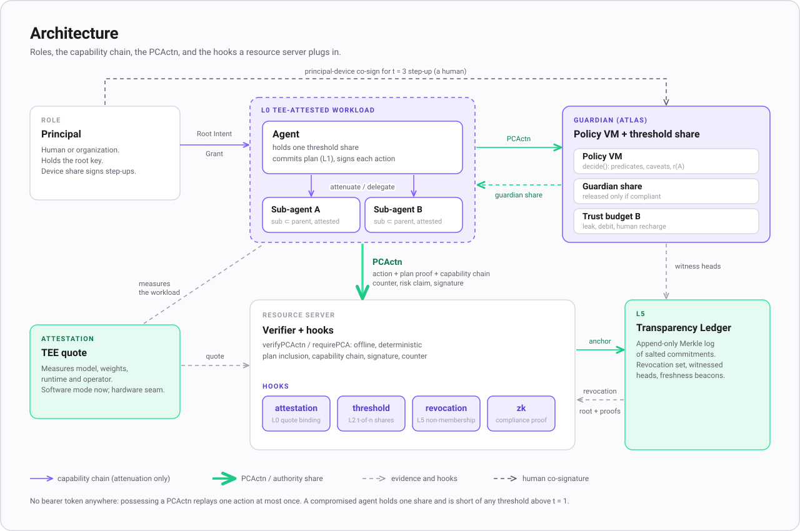

<div align="center">

# Proof-Carrying Authority (PCA)

**An execution-authentication framework for autonomous agents — and its reference TypeScript implementation.**



</div>

---

Classic auth answers two questions:

- **authN** — *who are you?* (OIDC, passkeys)
- **authZ** — *what may you do?* (OAuth scopes, roles)

Those were enough when a human was behind every action: the human *is* the policy engine, and their
identity implies faithfulness. An autonomous agent breaks that assumption — it is a stochastic,
externally-steerable process whose actions are unknown at grant time and manipulable (prompt injection,
tool-poisoning) at run time. A bearer token in a hijacked agent is full impersonation.

PCA adds a third question:

- **authF** — *is this specific action a faithful, uncompromised execution of an authority the principal
  actually conferred?*

PCA makes `authF` cheaply verifiable by replacing the bearer token with a **Proof-Carrying Action
(PCActn)**: with every action the agent presents a self-contained object, and the resource server
verifies a *proof* — not the possession of a secret. The core verifier runs **offline** with a stateless
set of eight fail-closed checks in a fixed, normative order; every higher capability (post-quantum
signatures, threshold step-up, zero-knowledge compliance, MPC policy evaluation, homomorphic risk gates)
is an additive, independently-adoptable rung on top of the base wire.

**This repository is the flagship.** It carries the reference **TypeScript** implementation (the
`@atlasauth/pca` core plus 73 published `@atlasauth/pca*` packages), the full explainer
docs and diagrams, the interactive playground, and the shared conformance corpus. The nine native
verifiers in other languages live in their own repos and pass this same corpus — see
[`verifiers/`](./verifiers) and [`ECOSYSTEM.md`](./ECOSYSTEM.md) for the whole map.

---

## Install

```sh
# the core verifier
npm install @atlasauth/pca

# a framework adapter (pick your server)
npm install @atlasauth/pca-express   # or pca-fastify, pca-hono, pca-next
```

```ts
import { verifyPCActn } from "@atlasauth/pca";

const verdict = await verifyPCActn(pcactn, { audience: "https://api.example.com" });
if (!verdict.ok) throw new Error(`authF failed: ${verdict.reason}`);
```

See each package's own `README.md` and the [docs](./docs) for the full model.

---

## The loop

<div align="center">

</div>

1. **Mint a Root Intent Grant.** The principal signs an envelope (goal commitment, action predicates,
   caveats, risk policy, agent binding) with their root key. `mintGrant()`.
2. **Attenuate or delegate.** An agent or sub-agent receives a capability that can only be narrowed.
   `delegate()` / `attenuate()`.
3. **Commit a plan.** The agent commits the Merkle root of a DAG of intended actions. `commitPlan()`.
4. **Act.** Each action is a signed PCActn carrying an inclusion proof for its plan node, the capability
   chain, a monotonic counter and a risk claim. `buildPCActn()` / `agent.act()`.
5. **Decide.** The Policy VM evaluates predicates, caveats, the risk functional and the trust budget, and
   either releases the guardian signing share or refuses. `decide()`.
6. **Verify.** The resource server checks every clause, offline and deterministically.
   `verifyPCActn()` / `requirePCA()`.
7. **Outcome.** `allowed` (anchored in the transparency ledger, receipt returned), `denied`, or `step_up`
   (the risk needs a principal-device co-signature).

---

## The eight-check core

A PCActn is a single **strict canonical JSON** object (wire version **2**). A resource server verifies it
**offline** with a stateless core of eight checks, run in a fixed, normative order and every one
**fail-closed**:

| # | Check | What it proves |
|---|-------|----------------|
| 1 | `wire` | Strict canonical form, closed field set. **Terminal** — a failure here stops everything. |
| 2 | `version` | Protocol version is understood (`ver = 2`). |
| 3 | `audience` | The signed `aud` equals *this* resource server's id (fail-closed). |
| 4 | `validity` | Issued-at / expiry window and clock skew (bounded lifetime). |
| 5 | `chain` | The capability chain verifies and only ever *attenuates* (`cap_chain`). |
| 6 | `plan_inclusion` | The action is a committed node of the authorized plan (Merkle proof). |
| 7 | `leaf_signature` | The capability-chain leaf holder signed the canonical body. |
| 8 | `counter` | A monotonic anti-replay counter is present and well-formed. |

Richer rungs — attestation, taint gating, threshold co-signing, revocation, zero-knowledge, bonds — are
verifier **hooks** layered on this core; each reports *not-enforced* unless you configure it, and
*not-enforced is never pass*, so a relying party requiring a stronger rung inspects the per-check results
and refuses anything it needed.

<div align="center">

</div>

---

## The verifier matrix

PCA ships native, offline PCActn verifiers that all pass the **same shared conformance corpus** (in
[`conformance/`](./conformance)) — a PCActn that verifies in one language verifies identically in every
other. The TypeScript verifier in this repo is the reference; the other nine are indexed in
[`verifiers/`](./verifiers).

| Language | Package / repo | Post-quantum |
|----------|----------------|--------------|
| TypeScript (reference) | [`@atlasauth/pca`](./packages/pca) | Yes |
| Go | [`pca-go`](https://github.com/Atlas-Authorization/pca-go) | Yes |
| Python | [`pca-python`](https://github.com/Atlas-Authorization/pca-python) | Yes |
| Ruby | [`pca-ruby`](https://github.com/Atlas-Authorization/pca-ruby) | Yes |
| PHP | [`pca-php`](https://github.com/Atlas-Authorization/pca-php) | Yes |
| .NET | [`pca-dotnet`](https://github.com/Atlas-Authorization/pca-dotnet) | Yes |
| Swift | [`pca-swift`](https://github.com/Atlas-Authorization/pca-swift) | Yes |
| Java | [`pca-java`](https://github.com/Atlas-Authorization/pca-java) | Yes |
| Rust | [`pca-rust`](https://github.com/Atlas-Authorization/pca-rust) | Yes |
| Kotlin | [`pca-kotlin`](https://github.com/Atlas-Authorization/pca-kotlin) | Yes |

**Signature suites:** `ed25519` (default), `ml-dsa-65` (FIPS-204, post-quantum), and
`hybrid-ed25519-ml-dsa-65`. The suite id and post-quantum key are part of the signed body, so a downgrade
or key swap invalidates the action. All ten verifiers implement the post-quantum suites and pass the full
conformance corpus (including the post-quantum vectors).

Beyond TypeScript, PCA also ships **Python agent-framework adapters** (LangGraph, CrewAI, Pydantic AI,
Google ADK, Microsoft Agent Framework, Haystack, FastMCP) and **Rust proving crates** (Nova folding IVC,
Winterfell / Plonky3 STARKs, a RISC Zero zkVM port). The complete inventory is in
[`ECOSYSTEM.md`](./ECOSYSTEM.md).

---

## Trust budget & step-up

<div align="center">

&nbsp;

</div>

Authorization is a closed-loop controller: a risk functional sets the required threshold, a depleting
budget bounds total risk-weighted autonomous action between human check-ins, and a provable a-priori
blast-radius bound is machine-checked. High-risk actions escalate to a `t-of-n` co-sign, up to a
principal-device step-up.

---

## Architecture

<div align="center">

</div>

See [`docs/`](./docs) for the full explainer: [concepts](./docs/concepts), [guides](./docs/guides),
[reference](./docs/reference), and the [security model](./docs/security). All diagrams (SVG + Mermaid
source) are in [`docs/diagrams`](./docs/diagrams).

---

## Packages

This repo publishes **73** TypeScript packages under the
[`@atlasauth`](https://www.npmjs.com/org/atlasauth) scope. The core is `@atlasauth/pca`; everything else
is a framework adapter, crypto rung, protocol bridge, or agent-framework integration that builds on it.

| Package | What it does |
|---------|--------------|
| [`@atlasauth/pca`](packages/pca) | Proof-Carrying Authority core: canonical hashing, Ed25519, Merkle plan commitments, attenuable capability chains, PCActn verifier (M0). |
| [`@atlasauth/pca-a2a`](packages/pca-a2a) | A2A (Agent2Agent) adapter for PCA: verify/attach proof-carrying actions on A2A task send/receive, validate Signed Agent Cards, and an AP2 payment-mandate profile. |
| [`@atlasauth/pca-abe`](packages/pca-abe) | Proof-carrying encryption for PCA: attribute/policy-based encryption on BLS12-381 so a tool payload decrypts only for a holder whose capability satisfies the policy — binding confidentiality to proven authority. |
| [`@atlasauth/pca-acp`](packages/pca-acp) | Agentic Commerce (ACP) + x402 adapter for PCA: mint an ACP delegated one-time payment token (bound to session+merchant+amount+expiry) AS a PCA proof, and an x402/HTTP-402 facilitator hook that gates settlement on a verified PCActn. |
| [`@atlasauth/pca-agent`](packages/pca-agent) | Agent-side client for Proof-Carrying Authority: commit a plan, act with a PCActn + threshold share, handle step-up, delegate to sub-agents, verify receipts. |
| [`@atlasauth/pca-agentcard`](packages/pca-agentcard) | Signed agent card + AgentFacts attestor for PCA: issue/host a /.well-known/agent-card.json (A2A AgentCardSignature) and an AgentFacts metadata doc where PCA is the THIRD-PARTY attestor (separating self-asserted from attested), pointing to live verifiable proof-of-authority. |
| [`@atlasauth/pca-aggsig`](packages/pca-aggsig) | BLS signature aggregation for PCA: collapse a delegation chain per-hop signatures and transparency-ledger witness cosignatures into one compact BLS12-381 aggregate with aggregate-verify. |
| [`@atlasauth/pca-ai-sdk`](packages/pca-ai-sdk) | Vercel AI SDK adapter for Proof-Carrying Authority: wrap an AI SDK tool so every call emits a PCActn (and attaches the proof) before execute runs. |
| [`@atlasauth/pca-analyzer`](packages/pca-analyzer) | Static authority analyzer for Proof-Carrying Authority: a sound, bounded decision procedure over PCA's predicate/caveat policy (reachability, vacuity/totality, delegation-safety subsumption, disjointness, equivalence, and declared-intent conformance) with counterexamples. |
| [`@atlasauth/pca-anthropic`](packages/pca-anthropic) | Anthropic (Claude) adapter for Proof-Carrying Authority: turn a tool_use block into a PCActn and build the tool_result with the proof attached. |
| [`@atlasauth/pca-ap2`](packages/pca-ap2) | AP2 (Agent Payments Protocol, FIDO) wire-compatibility for PCA: map the grant/budget to Intent/Cart/Payment mandate VDCs; PCA governs, x402 / Stripe Shared-Payment-Tokens settle. |
| [`@atlasauth/pca-attest-eat`](packages/pca-attest-eat) | Per-session attestation freshness + channel binding for PCA (IETF SEAT / RA-TLS), emitting EAT (RFC 9711) with a RATS appraisal-policy split — so TEE evidence can't be replayed. |
| [`@atlasauth/pca-authzen`](packages/pca-authzen) | AuthZEN PDP for PCA: expose the PCA verifier/policy engine behind the OpenID AuthZEN Authorization API (subject/action/resource/context) with the COAZ MCP-tool and AARP approval profiles, so any AuthZEN PEP can use PCA as its decision point. |
| [`@atlasauth/pca-bbs`](packages/pca-bbs) | BBS signatures (CFRG draft) for PCA: issue a capability as a multi-message BBS credential, then present it with selective disclosure + unlinkable zero-knowledge proof-of-possession, so an agent reveals only the attributes a tool needs and uses can't be correlated. |
| [`@atlasauth/pca-ciba`](packages/pca-ciba) | CIBA (Client-Initiated Backchannel Authentication) bridge for PCA FROST step-up: turn a step-up request into a backchannel human-approval flow with risk-adaptive gating. |
| [`@atlasauth/pca-cli`](packages/pca-cli) | The pca dev CLI: decode and explain a PCActn (why it passed or failed each check), mint a dev grant/key, and simulate a policy over actions. |
| [`@atlasauth/pca-compliance`](packages/pca-compliance) | Compliance export for PCA: render PCA proofs + decision records (incl. delegation chain + human-override) into auditor-ready reports pre-mapped to EU AI Act Art. 12/50, ISO 42001 clauses, and SOC 2 CC6. |
| [`@atlasauth/pca-conformance`](packages/pca-conformance) | Canonical PCActn conformance vectors + a differential harness so every PCA verifier implementation (the 9 language SDKs, the zkVM, the TS core) provably agrees on accept/reject for the same inputs. |
| [`@atlasauth/pca-connect`](packages/pca-connect) | Outbound connection token vault for PCA agents: hold and refresh an agent's third-party OAuth tokens (Google/Slack/etc.) under a PCA capability, so a tool call presents a provably-authorized, least-privilege outbound token. |
| [`@atlasauth/pca-connectors`](packages/pca-connectors) | Declarative outbound connector registry for PCA: provider manifests (auth URLs, scopes, refresh, token placement) for the top SaaS tools + an auto-refresh helper, so every vault connector call is a proof-carrying capability. |
| [`@atlasauth/pca-control-evals`](packages/pca-control-evals) | Empirical adversarial control-evaluation harness for PCA: a seeded red-team/blue-team game (Redwood-style AI Control) that scores safety = P(a possibly-misaligned agent cannot cause an unacceptable outcome) + usefulness against PCA's verifier/budget/step-up/DLP/immune controls. Complements the analytic Σrisk ≤ bMax/κ bound. |
| [`@atlasauth/pca-dataflow`](packages/pca-dataflow) | CaMeL-style capability-tagged data-flow model for PCA: provenance capabilities propagate through combinators and a policy interpreter gates value→sink flows for provable non-exfiltration — the positive complement to the heuristic DLP/taint in @atlasauth/pca. |
| [`@atlasauth/pca-dpop`](packages/pca-dpop) | Sender-constrained proof-of-possession for PCA: RFC 9449 DPoP proofs and RFC 8705 mTLS cnf binding, tying a PCActn to the holder key/channel for OAuth PoP interop. |
| [`@atlasauth/pca-events`](packages/pca-events) | Typed step-up lifecycle events + signed webhooks for Proof-Carrying Authority: build, HMAC-sign and verify step-up.created/approved/denied/expired events so integrators can run their own inbox, Slack bot or audit sink. |
| [`@atlasauth/pca-explain`](packages/pca-explain) | Plain-language proof-trace for PCA decisions: given a PCActn and its verify/decide result, explain exactly why it was allowed or denied — which capability granted it, which caveat narrowed or failed, the risk/threshold/budget path, and the first failing check with a remedy. |
| [`@atlasauth/pca-express`](packages/pca-express) | Express middleware for Proof-Carrying Authority: requirePCA() verifies the inbound PCActn and attaches the verdict, or answers 401/403 with a WWW-Authenticate challenge. |
| [`@atlasauth/pca-fastify`](packages/pca-fastify) | Fastify plugin/preHandler for Proof-Carrying Authority: verifies the inbound PCActn, attaches the verdict, or replies 401/403 with a WWW-Authenticate challenge. |
| [`@atlasauth/pca-fetch`](packages/pca-fetch) | Runtime-neutral Web Fetch guard for Proof-Carrying Authority: verify an inbound PCActn in any Request→Response runtime (Cloudflare Workers, Deno, Bun, Vercel Edge, Lambda). |
| [`@atlasauth/pca-fhe`](packages/pca-fhe) | Homomorphic risk-gate evaluation for PCA: the evaluator computes the weighted risk functional + admission slack over ENCRYPTED risk inputs (node-seal / Microsoft SEAL BFV) and never sees the plaintext — only the authorized key holder decrypts the verdict. |
| [`@atlasauth/pca-fndsa`](packages/pca-fndsa) | FN-DSA / Falcon (FIPS 206 draft) suite for PCA: register the compact PQ signature suite in the crypto-agility seam with a pluggable, vetted verify backend (a constant-time Falcon is not safely hand-rolled in TS) — wire format, suite ids, and KAT-driven integration tests. |
| [`@atlasauth/pca-gateway`](packages/pca-gateway) | Drop-in PCA enforcement for API gateways/service meshes: a framework-agnostic ext_authz handler that verifies a proof-carrying action per request (Envoy HTTP ext_authz, Cloudflare Worker, Lambda authorizer) so unmodified services get code-free proof enforcement. |
| [`@atlasauth/pca-gnap`](packages/pca-gnap) | GNAP (RFC 9635) bridge for PCA, defining an agent-GNAP profile: map a GNAP grant request/response + continuation to an attenuated PCA capability, with GNAP continuation mapped to FROST/CIBA step-up and key-bound (jwsd) requests. |
| [`@atlasauth/pca-harness`](packages/pca-harness) | PCA framework-evolution B1 reference prototype: an auditable orchestration harness (the attested TCB) that wraps an UNTRUSTED model/tool oracle and enforces the PCA invariants (plan-inclusion, taint, trust-budget) before any action becomes a signed PCActn. |
| [`@atlasauth/pca-hono`](packages/pca-hono) | Hono middleware for Proof-Carrying Authority: verifies the inbound PCActn, sets the verdict on the context, or answers 401/403 with a WWW-Authenticate challenge. |
| [`@atlasauth/pca-idjag`](packages/pca-idjag) | ID-JAG / OAuth Cross-App-Access bridge for PCA: verify an identity-assertion authorization grant (sub=human, act=agent, scoped, single-audience) and map it to a PCA principal/capability; RFC 8693/7523 token-exchange. |
| [`@atlasauth/pca-invariants`](packages/pca-invariants) | Property-based verification of PCA's core safety invariants (attenuation monotonicity, budget soundness, fail-closed) across thousands of randomly-generated capability chains and policies. |
| [`@atlasauth/pca-langchain`](packages/pca-langchain) | LangChain adapter for Proof-Carrying Authority: wrap a StructuredTool so every invocation emits a PCActn (and attaches the proof) before the tool runs. |
| [`@atlasauth/pca-llamaindex`](packages/pca-llamaindex) | LlamaIndex.TS adapter for Proof-Carrying Authority: wrap a FunctionTool so each call emits a PCActn before it runs. |
| [`@atlasauth/pca-mastra`](packages/pca-mastra) | Mastra tool guard for PCA: wrap a Mastra createTool so each execute is proof-carrying + policy-gated, with step-up on a workflow step. |
| [`@atlasauth/pca-mcp`](packages/pca-mcp) | Model Context Protocol adapter for Proof-Carrying Authority: wrap an MCP tool handler so every call emits a PCActn (and attaches the proof) before the handler runs. |
| [`@atlasauth/pca-mcp-rs`](packages/pca-mcp-rs) | MCP authorization resource-server for the 2026-07-28 spec: serve RFC 9728 PRM + Client-ID Metadata Documents, enforce RFC 8707 resource indicators + RFC 9207 issuer validation + scope accumulation, and wire PCA FROST step-up into the MCP step-up challenge. |
| [`@atlasauth/pca-mpc`](packages/pca-mpc) | PCA evolution B5 reference prototype: a multi-stakeholder Policy VM composed under secure multi-party computation (semi-honest additive secret sharing over a prime field), so user+org+regulator jointly decide allow/threshold without any party revealing its own policy. |
| [`@atlasauth/pca-mpc-wasm`](packages/pca-mpc-wasm) | Constant-time Ed25519 base-OT curve core (curve25519-dalek, compiled to WebAssembly): a drop-in, genuinely constant-time replacement for @atlasauth/pca-mpc's pure-BigInt ec.ts curve ops, closing the JS/runtime constant-time boundary of docs §7.1. |
| [`@atlasauth/pca-next`](packages/pca-next) | Next.js helper for Proof-Carrying Authority: wrap a Route Handler so the inbound PCActn is verified before your handler runs, with a 401/403 response otherwise. |
| [`@atlasauth/pca-notary`](packages/pca-notary) | External-fact attestation (zkTLS/TLSNotary direction) for PCA: a notary signs the observed response of an external request, selectively redactable, bound into a PCActn so an agent proves 'the external API returned X' as part of its proof-carrying action. |
| [`@atlasauth/pca-oauth`](packages/pca-oauth) | OAuth 2.1 / MCP-authorization interop bridge for Proof-Carrying Authority: make a PCA resource server discoverable (RFC 9728 Protected Resource Metadata), challengeable (MCP 401 + WWW-Authenticate resource_metadata), and bindable (RFC 8707 resource indicators) over the agent-to-tool wire. PCA stays the proof layer; this is the discovery/challenge envelope. |
| [`@atlasauth/pca-oidc`](packages/pca-oidc) | Root a PCA grant in a real OIDC-authenticated human: verify an ID token (discovery + JWKS) and map its subject/claims to the PCA principal. |
| [`@atlasauth/pca-openai`](packages/pca-openai) | OpenAI adapter for Proof-Carrying Authority: turn a model tool_call into a PCActn and run the handler with the proof attached. |
| [`@atlasauth/pca-openai-agents`](packages/pca-openai-agents) | OpenAI Agents SDK (@openai/agents) guard for PCA: guardrail + tool-execution hook so each agent tool call is proof-carrying + policy-gated. |
| [`@atlasauth/pca-oprf`](packages/pca-oprf) | OPRF (RFC 9497) + PSI for PCA: private rate-limiting and private revocation checks without revealing which capability or identifier. |
| [`@atlasauth/pca-otel`](packages/pca-otel) | OpenTelemetry instrumentation for Proof-Carrying Authority: wrap a verification guard so each decision emits a span (tier, decision, budget) and metrics, with a no-op fallback when OpenTelemetry is absent. |
| [`@atlasauth/pca-payments`](packages/pca-payments) | Reference prototype: a payment mandate (merchant/category allowlist, per-transaction + cumulative caps, auto-approve threshold Y, hard ceiling X, bonded refunds) expressed as a PCA Root Intent Grant — PCA as the authorization layer for agentic payments (AP2 / x402). |
| [`@atlasauth/pca-policy-bridge`](packages/pca-policy-bridge) | Import external authz policy into PCA: compile Cedar and OPA/Rego policies and OpenFGA/Zanzibar ReBAC models+tuples into PCA predicates/caveats, so existing enterprise policy engines drive proof-carrying authority. |
| [`@atlasauth/pca-policy-ci`](packages/pca-policy-ci) | CI gate for PCA policies: statically flag over-broad grants, privilege-escalation in delegation chains, unused/redundant caveats, and reachability of dangerous actions — fail the build before an unsafe policy ships. |
| [`@atlasauth/pca-pq-threshold`](packages/pca-pq-threshold) | Post-quantum threshold step-up for PCA: a production-ready HYBRID (classical FROST quorum + an ML-DSA PQ co-signature over the same action) so a step-up is PQ-protected today, plus a documented Raccoon/Ringtail lattice-threshold research design for the trustless-PQ future. |
| [`@atlasauth/pca-rag`](packages/pca-rag) | FGA-for-RAG for PCA: retrieval-time, per-principal document filtering driven by the PCA policy engine, with the filtering decision captured in the proof trace (provable: the model only saw authorized data). |
| [`@atlasauth/pca-ratchet`](packages/pca-ratchet) | PCA Capability Ratchet: puncturable forward-secure capability keys (cryptographic one-time-use — a spent action can never be re-signed) plus a homomorphic Pedersen risk accumulator for zero-knowledge proof of the Sigma-risk <= budget ceiling across a delegation chain. |
| [`@atlasauth/pca-revoke`](packages/pca-revoke) | Realtime revocation + mid-run kill-switch for PCA: revoke a capability, an agent holder, or a whole delegation subtree, and deny in-flight actions against a pluggable revocation registry (Shared-Signals/CAEP consumable). |
| [`@atlasauth/pca-rotate`](packages/pca-rotate) | Key rotation + subtree revocation for PCA: rotate an agent holder key or a principal/root key by re-issuing the chain under new keys, and revoke-and-reissue a compromised delegation subtree, emitting revocation records. |
| [`@atlasauth/pca-schema`](packages/pca-schema) | JSON Schema (draft 2020-12) for the PCA wire types — PCActn, capability/grant, discovery doc — plus a tiny validator, so any language can codegen types and validate payloads. |
| [`@atlasauth/pca-scim`](packages/pca-scim) | SCIM 2.0 /agents provisioning for PCA: expose the agent-passport registry as a SCIM resource (and push-provision to Entra Agent ID / Okta), so PCA agents live in the enterprise directory with lifecycle/governance. |
| [`@atlasauth/pca-scitt`](packages/pca-scitt) | SCITT transparency receipts for PCA (RFC 9943/9942): register each verified PCActn as a COSE Signed Statement and return/verify the COSE inclusion receipt, turning PCA's decision record into standards-shaped, externally-verifiable append-only audit evidence. |
| [`@atlasauth/pca-sdjwt`](packages/pca-sdjwt) | SD-JWT serialization of a PCActn for PCA: emit/verify a PCActn (and its capability claims) as a selectively-disclosable SD-JWT so PCA proofs drop into existing JWT/SD-JWT verifiers and align with WIMSE / AP2 mandate shape. |
| [`@atlasauth/pca-siem`](packages/pca-siem) | SIEM export for PCA decisions: emit each verified/denied action as an OCSF Authorization event (and CEF), streamable to Splunk/Elastic/Datadog/Sentinel — the security-event feed complementing OTel traces. |
| [`@atlasauth/pca-signals`](packages/pca-signals) | Shared Signals Framework (CAEP/SSF) for PCA: build + verify Security Event Tokens (RFC 8417) for grant revocation and mid-run kill-switch propagation to in-flight agents. |
| [`@atlasauth/pca-spiffe`](packages/pca-spiffe) | Bridge PCA agent identity with SPIFFE/SPIRE workload identity: parse/verify JWT-SVIDs and X.509-SVID SPIFFE IDs, map a SPIFFE ID to/from a PCA agent holder. |
| [`@atlasauth/pca-testing`](packages/pca-testing) | Testing kit for Proof-Carrying Authority: factories for grants and PCActns, a fake verifier and state store, and assertion helpers so integrators can unit-test their PCA wiring. |
| [`@atlasauth/pca-txn-tokens`](packages/pca-txn-tokens) | Express a PCA capability chain as OAuth Token Exchange (RFC 8693) nested sub/act claims + a Transaction-Tokens-for-agents profile — standards-native chain-of-custody. |
| [`@atlasauth/pca-vc`](packages/pca-vc) | Emit the PCA agent passport as a W3C Verifiable Credential 2.0 (SD-JWT) bound to a DID, and sign requests per RFC 9421 HTTP Message Signatures (Web Bot Auth Signature-Agent). |
| [`@atlasauth/pca-vdf`](packages/pca-vdf) | Verifiable Delay Function timelock for PCA: a mandatory, offline-verifiable cooling-off on irreversible actions — a VDF proof that T sequential steps elapsed gates execution, with no trusted clock. Wesolowski-style proof (cheap verify). |
| [`@atlasauth/pca-vercel-ai`](packages/pca-vercel-ai) | Vercel AI SDK tool-execution middleware for PCA: wrap a tool so each call attaches/verifies a proof-carrying action before execution, with step-up (prepareStep) on the agent loop. |
| [`@atlasauth/pca-webauthn`](packages/pca-webauthn) | Phishing-resistant human co-sign for PCA FROST step-up via WebAuthn/FIDO2 passkeys: verify an authenticator assertion as the principal/guardian approval. |
| [`@atlasauth/pca-webbotauth`](packages/pca-webbotauth) | Web Bot Auth for PCA (RFC 9421 HTTP Message Signatures): sign outbound agent HTTP requests with an Ed25519 key published at /.well-known/http-message-signatures-directory, optionally carrying the PCA per-action proof, so PCA agents pass Cloudflare/AWS-WAF bot verification AND carry proof-of-authority. |

---

## Working in this repo

```sh
pnpm install          # install the workspace
pnpm -r build         # build every package
pnpm -r test          # run every package's tests
pnpm -r typecheck     # typecheck every package
```

The packages are a pnpm workspace (`packages/*`). Each package builds with `tsc` and tests with
`vitest`. The conformance corpus and primitive test vectors are committed alongside the packages that
own them (and vendored at [`conformance/`](./conformance)), so every build is reproducible offline. The
[playground](./playground) is a single page that runs the real library in the browser.

---

## License

MIT — see [`LICENSE`](./LICENSE).
