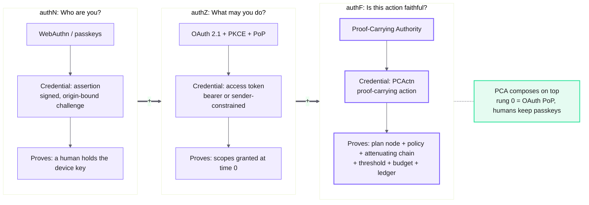
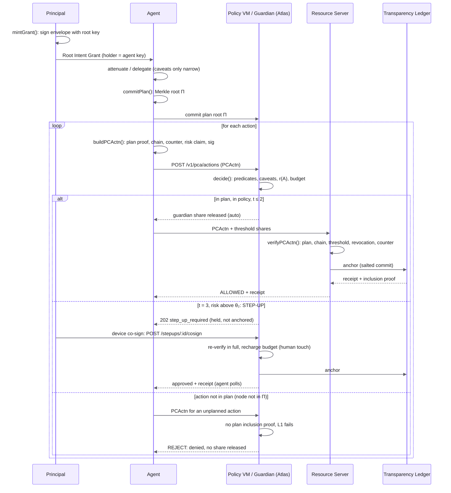
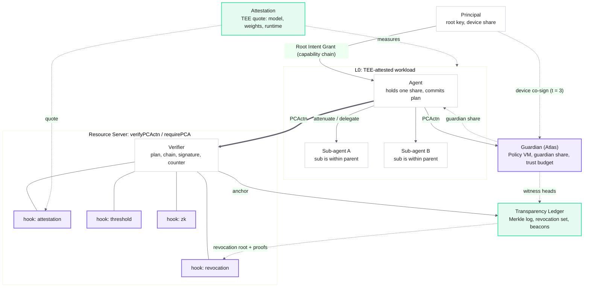
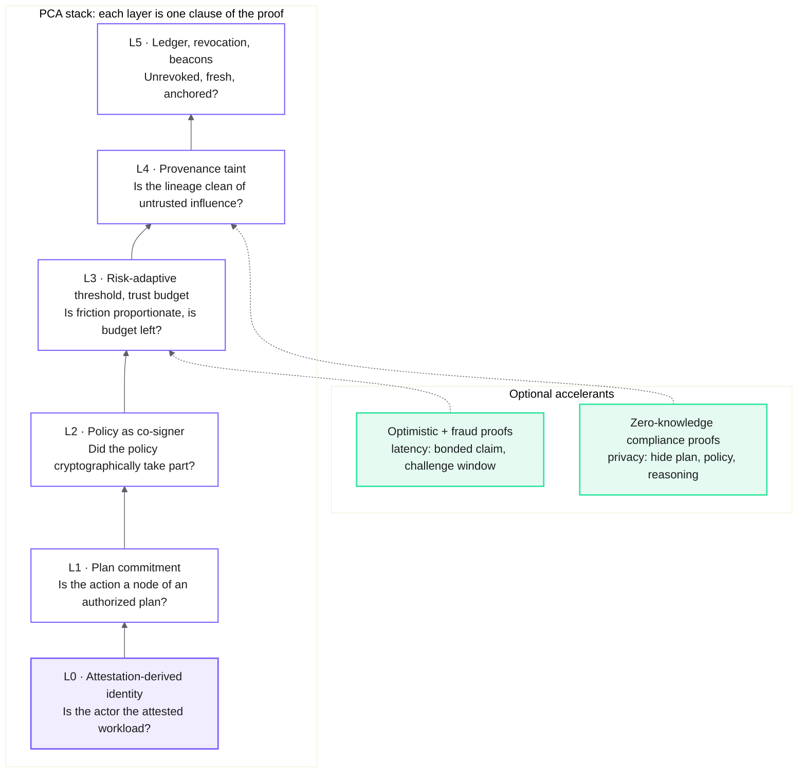
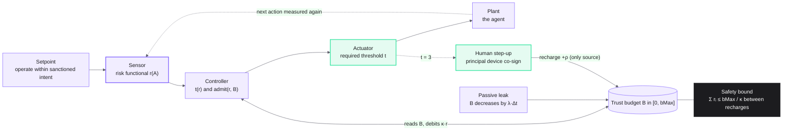
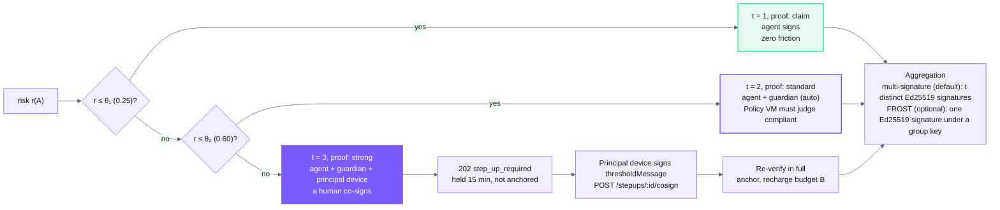
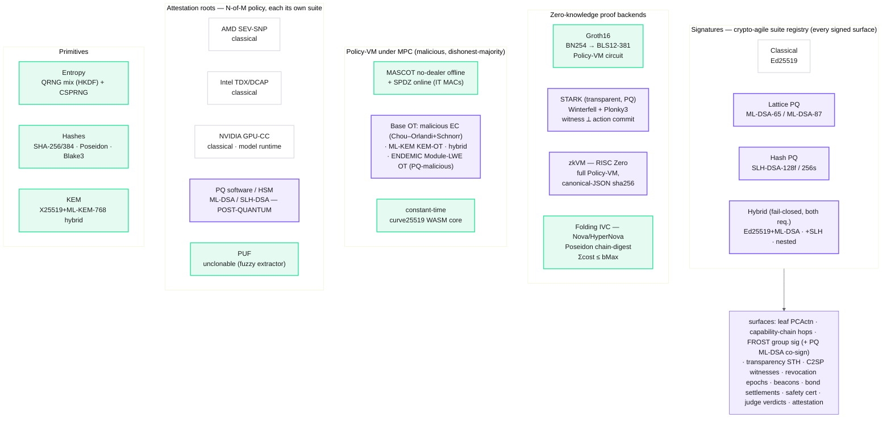

# PCA diagrams: Mermaid blocks

Paste any block into GitHub markdown. Each block is identical to the matching `.mmd` file.

## authN, authZ, authF

The three questions (who are you, what may you do, is this action faithful), their credentials, and PCA composing on top.

## The PCA loop

Sequence: mint, attenuate, commit plan, emit PCActn, decide, verify, anchor, with the t = 3 step-up and out-of-plan reject branches.

## Architecture

Principal, agent and sub-agents, guardian (Atlas), resource server with its hooks, transparency ledger and TEE attestation, with the capability chain and PCActn flows.

## The PCA stack

Layers L0 to L5, one proof clause each, plus the optimistic and zero-knowledge accelerants.

## Trust budget

Control-system view: risk sensor, threshold actuator, depleting budget with human recharge, and the sum r <= bMax / kappa bound.

## Threshold and step-up

Escalation t = 1, 2, 3 by risk, the hosted step-up flow, and multi-signature versus FROST aggregation.

## Cryptographic backends

