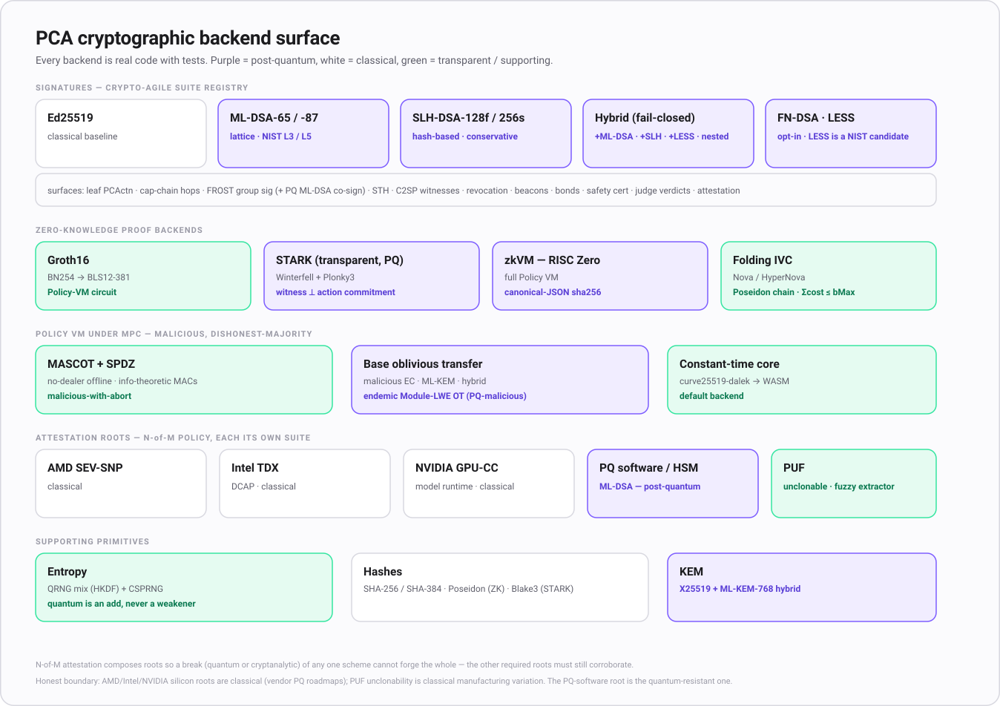

# PCA diagrams

Professional diagrams for Proof-Carrying Authority. Each has a self-contained `.svg` (for docs and embedding) and a `.mmd` Mermaid source (renders natively on GitHub). All Mermaid blocks are collected in [MERMAID.md](./MERMAID.md).

| Diagram | Caption | Files |
|---|---|---|
| authN, authZ, authF | The three questions (who are you, what may you do, is this action faithful), their credentials, and PCA composing on top. | [svg](authn-authz-authf.svg) / [mmd](authn-authz-authf.mmd) |
| The PCA loop | Sequence: mint, attenuate, commit plan, emit PCActn, decide, verify, anchor, with the t = 3 step-up and out-of-plan reject branches. | [svg](pca-loop.svg) / [mmd](pca-loop.mmd) |
| Architecture | Principal, agent and sub-agents, guardian (Atlas), resource server with its hooks, transparency ledger and TEE attestation, with the capability chain and PCActn flows. | [svg](architecture.svg) / [mmd](architecture.mmd) |
| The PCA stack | Layers L0 to L5, one proof clause each, plus the optimistic and zero-knowledge accelerants. | [svg](pca-stack.svg) / [mmd](pca-stack.mmd) |
| Trust budget | Control-system view: risk sensor, threshold actuator, depleting budget with human recharge, and the sum r <= bMax / kappa bound. | [svg](trust-budget.svg) / [mmd](trust-budget.mmd) |
| Threshold and step-up | Escalation t = 1, 2, 3 by risk, the hosted step-up flow, and multi-signature versus FROST aggregation. | [svg](threshold-stepup.svg) / [mmd](threshold-stepup.mmd) |
| Cryptographic backends | The full backend surface: the crypto-agile signature suite registry (classical, lattice/hash PQ, hybrids), the four zero-knowledge backends, the malicious-secure MPC Policy VM, the five composable attestation roots, and supporting primitives. | [svg](crypto-backends.svg) / [mmd](crypto-backends.mmd) |

See also the [PCA overview](../README.md) and the [specification](../../specs/agentic-auth-proof-carrying-authority.md).

## authN, authZ, authF

## The PCA loop

## Architecture

## The PCA stack

## Trust budget

## Threshold and step-up

## Cryptographic backends

