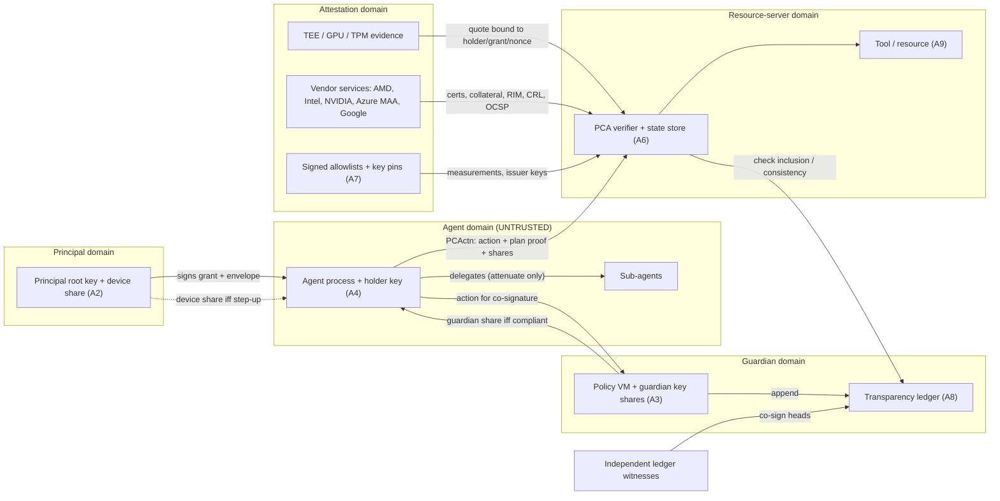

# Threat model

This page is the integrator-facing threat model for Proof-Carrying Authority (PCA). It states what we protect, who we assume the attacker is, what each attacker can and cannot do, a catalogue of concrete attacks with the mechanism that stops each one, and the guarantees PCA documents as a result.

Read it together with the [Trust model](./trust-model.md), which says what each party is trusted for and where the current release is a reference rather than a hardened component. Auditors: the mapping from every attack and guarantee below to the automated tests that exercise it is in [Traceability](./traceability.md).

**Status, stated plainly.** PCA is in preview. It has an extensive automated test suite and cross-language conformance vectors, but it has **not had an external cryptographic or security audit**. Do not make a preview deployment the sole control over high-value or irreversible actions. Every mitigation below names the mechanism and its assumptions; where a mitigation depends on something the integrator must operate (a replay store, a revocation-root feed, an independent witness), that is called out as an assumption and not hidden.

## 1. Assets

| Asset | Why it matters |
|---|---|
| A1. The principal's authority (the grant) | The root of all delegated power. Its envelope bounds everything an agent can do. |
| A2. Principal root key and device share | Signs the grant; supplies the human share for high-risk (`t = 3`) actions. |
| A3. Guardian signing key / key shares | Releases the policy-gated share only for compliant actions. |
| A4. Agent holder key | Signs actions. Assumed stealable. |
| A5. The trust budget | The bound on total autonomous risk between human recharges. |
| A6. Resource-server state | Counters, budget meters, revocation roots, nonces. Replay and over-spend defenses live here. |
| A7. Attestation trust anchors | Vendor roots, allowlists, key pins, collateral. A wrong anchor makes every attestation meaningless. |
| A8. The transparency ledger | The non-repudiable record of what was authorized and done. |
| A9. Data the agent can reach | Tool arguments, resources, outputs. What a compromised agent would exfiltrate. |

## 2. Trust boundaries

Everything crossing a boundary is treated as attacker-influenced. The agent domain is **untrusted by design**. The strongest guarantees need the principal, guardian and resource-server domains to be operated by separate parties or on separate machines; if one host holds every key share, a compromise of that host collapses the threshold (see the [Trust model](./trust-model.md)).

## 3. Attacker capability matrix

Each row lists what we **assume** the attacker can do, what PCA stops, and what remains. "Residual" is what the attacker can still achieve; it is not hidden by the mitigations in the catalogue.

| # | Attacker | Assumed capabilities | PCA stops | Can still achieve (residual) | Catalogue |
|---|---|---|---|---|---|
| 1 | **Passive network attacker** | Reads all traffic between agent, guardian, resource server, ledger. | Nothing sensitive needs to be secret for safety: there is no bearer token, so a captured PCActn is inert without fresh context. | Reads action contents, identities and timing. PCA provides **no confidentiality**; use TLS. | T-001, T-002, T-015 |
| 2 | **Active network attacker** | Modifies, drops, replays, reorders messages. | Tampering (signed canonical body), replay to another server (signed audience), replay inside the window (counter, with a store), reorder (counter). | Denial of service (drop/delay). Replay inside the validity window **if the resource server keeps no counter store**. | T-001, T-002, T-014 |
| 3 | **Malicious or compromised agent** | Full code execution in the agent; holds the agent key; can craft any request. | Acting outside the committed plan; exceeding the envelope; producing a threshold signature above `t = 1` alone; self-widening a delegation; understating its own risk or taint. | Any in-plan, in-policy, taint-clean, low-risk action, up to the trust-budget bound. | T-004, T-006, T-007, T-012, T-013, T-032, T-033 |
| 4 | **Prompt-injected agent** | Attacker-controlled text steers the agent's tool calls; agent process itself is intact. | Out-of-plan actions (no inclusion proof); actions whose lineage is tainted (risk rises, step-up or refusal); high-risk irreversible actions (human share). | Harmful *in-plan* actions the principal already sanctioned, or low-risk exfiltration within DLP/taint limits. | T-006, T-032, T-034 |
| 5 | **Malicious or compromised tool / resource server** | Sees every PCActn presented to it; may replay it elsewhere; may lie about outcomes. | Re-use of a PCActn at a different server (audience); forging new actions (needs signatures); learning the private plan in the ZK path. | Reads everything in plain-mode actions; can misreport the effect of an action; can act on actions it legitimately receives. | T-002, T-035, T-037 |
| 6 | **Malicious sub-agent** | Receives a delegation; may be fully hostile. | Widening scope, dropping caveats, exceeding depth, over-allocating budget. | Everything its (narrowed) delegation allows. | T-004, T-005 |
| 7 | **Stolen or leaked capability / delegation token** | Obtains a copy of a capability chain or PCActn. | Use without the holder key: chains are holder-bound, not bearer. | Nothing, unless it also obtains the holder key (row 3). | T-013 |
| 8 | **Compromised guardian share(s), below threshold** | Holds `< t` of the guardian shares plus possibly the agent key. | Producing an accepted threshold signature; forging a share. | Learns what those shares see. | T-016, T-017 |
| 9 | **Compromised guardian shares, at/above threshold** | Holds a full quorum (or the single hosted guardian key) and the agent key. | Reaching `t = 3` actions (still needs the principal device share). | Everything up to `t = 2`: all medium-risk actions the guardian would co-sign. **Not bounded by the cryptography.** | T-016, T-019 |
| 10 | **Compromised principal device / root key** | Holds the principal key and device share. | Nothing: this is the root of authority. | Authorize anything within the grant; mint new grants. Detectable afterwards in the ledger, not preventable. | T-019 |
| 11 | **Malicious cloud operator / hypervisor** | Controls the host the agent runs on; can swap images, replay evidence, set debug policy, read memory outside the TEE boundary. | Running modified code under a measured identity (measurement and chain checks); presenting debug-mode silicon; replaying another workload's evidence. | Anything the TEE technology itself does not protect (side channels, availability); host-asserted fields such as HOST_DATA are only as good as the host. | T-020 to T-025, T-029 |
| 12 | **Compromised vendor attestation service** (Azure MAA, Google, a signing key of a vendor) | Can mint tokens/quotes that chain to that vendor's trust anchor. | Silent key rotation abuse (overlap rule, no trust-on-first-use); a single compromised root when several independent roots are required (N-of-M with reconciled identity). | If you rely on **one** vendor root, a compromise of that vendor defeats that root. | T-027, T-028 |
| 13 | **Attestation-collateral staleness** | Serves old but validly-signed collateral (TCB info, CRLs, OCSP, RIM). | Expired collateral, stale CRL/OCSP responses, clock regression, TCB below your floor, VCEK older than the claimed TCB. | The staleness window you configure (collateral `nextUpdate`, OCSP `maxAge`). | T-023, T-024 |
| 14 | **Supply-chain compromise of a dependency** | Ships a malicious version of a cryptographic or parsing library. | Wrong Ed25519/SHA-256/FROST outputs *are* detected by known-answer vectors in CI. | A subtle backdoor that passes vectors (for example a side channel, a nonce bias) is **not** detected. | T-048 |
| 15 | **Insider with log-operator access** | Operates the transparency log; can rewrite, fork, or withhold entries. | Rewriting history or serving different histories, *provided* independent witnesses co-sign heads and a monitor checks consistency. | Withholding or delaying entries (censorship) is not cryptographically detectable on its own. Without independent witnesses, split views are possible. | T-040, T-041 |
| 16 | **Quantum adversary** (harvest now, forge later) | Records all traffic today; has a CRQC later. | Forgery of PQ-suite signatures (ML-DSA, hybrid) and of PQ quorum certificates. | **Default surfaces are classical** (Ed25519, FROST/Ed25519, BN254 Groth16). Anything signed with only classical keys and still trusted later can be forged later. Because PCA is authentication, not encryption, harvested traffic has no secrecy to lose. | T-047 |
| 17 | **Side-channel / timing attacker** | Measures timing or microarchitectural effects of the verifier or signer. | Secret-dependent comparisons in the audited verifier surface; secret base-point multiplication is constant-time via the underlying library. | The reference FROST/DKG scalar arithmetic is **not constant-time**; the implementation has no side-channel hardening claim. | T-049 |
| 18 | **Denial-of-service attacker** | Sends oversized, deeply nested, or adversarially structured inputs; floods verification. | Unbounded recursion/size in the strict parser, chain depth, schemas, regex predicates, parameter stuffing. | Volumetric flooding; verification cost (signature checks) is not rate-limited by PCA. | T-046 |

## 4. Attack catalogue

Each entry has a stable ID. IDs never change meaning and are referenced from [Traceability](./traceability.md). "Mitigation" names the user-visible mechanism; "Guarantee" cross-references section 5; "Detection" says how an operator would notice an attempt.

### Protocol and delegation

### T-001 Replay on the same server
- **Attack.** Capture a valid PCActn and resubmit it (or reorder captured ones).
- **Preconditions.** Attacker can observe or obtain the signed action; resubmission is within the validity window.
- **Impact.** Re-execution of an authorized action (double spend, duplicate side effect).
- **Mitigation.** Every PCActn carries a signed audience, issue time and expiry (bounded lifetime) and a per-holder counter. The core verifier rejects expired, future-dated and over-long-lifetime actions. Counter monotonicity is enforced by the resource-server middleware (`requirePCA`) against a persisted store.
- **Guarantee.** G-5 (freshness), G-6 supports. Assumes the resource server persists counters. **The core verifier alone only checks that the counter is well-formed**; without a store, `requirePCA` reports the counter check as `not-enforced` rather than passing it.
- **Residual.** Replay inside the validity window against a server with no shared store (multi-node without a shared store is exposed).
- **Detection.** Counter-regression rejections; duplicate ledger entries.

### T-002 Replay at a different server (audience confusion)
- **Attack.** Present a PCActn obtained at server A to server B.
- **Preconditions.** Both servers trust the same grant; attacker has the action.
- **Impact.** Authority meant for A is exercised at B.
- **Mitigation.** The audience is part of the signed body; a verifier that has no configured audience **fails closed** on an audience-bearing action; `requirePCA` requires the audience as mandatory configuration.
- **Guarantee.** G-5. Assumes each resource server configures a distinct audience.
- **Residual.** Two servers configured with the same audience string accept each other's actions.
- **Detection.** Audience-mismatch rejections.

### T-003 Confused deputy / action swap
- **Attack.** Re-use a valid inclusion proof or signature for a different action than the one authorized.
- **Preconditions.** Attacker holds a valid proof for action X.
- **Impact.** Executing action Y under X's authority.
- **Mitigation.** The signed body commits the action; the plan-inclusion proof is a Merkle proof of that exact action node. A proof for a swapped action fails inclusion; a tampered action breaks inclusion and the signature. Optimistic claims and ZK statements are bound to the exact action digest.
- **Guarantee.** G-1, G-4.
- **Residual.** If the plan itself contains a dangerous node, it is reachable.
- **Detection.** Inclusion-proof failures.

### T-004 Privilege escalation by delegation widening
- **Attack.** A holder drops, edits or reorders a restricting caveat, re-points a parent link, issues a hop it does not hold, or allocates more budget than its parent.
- **Preconditions.** Holder of any intermediate capability.
- **Impact.** A child more powerful than its parent.
- **Mitigation.** Caveats are append-only and compared per-caveat by hash; every hop is hash-linked and holder-bound and verified against the parent holder's key; body digests are re-derived; chain depth is capped before any signature work; carried budget allocations must be monotone non-increasing.
- **Guarantee.** G-3.
- **Residual.** Chain verification is structural: a caveat type the policy engine does not understand must be rejected by the policy layer. Unknown caveat types are rejected in the mesh and agent-native evaluators; an integrator writing a custom evaluator must fail closed.
- **Detection.** Chain verification failures with the failing hop.

### T-005 Malicious sub-agent over-spend or depth abuse
- **Attack.** A delegated sub-agent spends beyond its allocation or delegates further than allowed.
- **Preconditions.** A sub-agent holds a narrowed capability.
- **Impact.** Parent budget drained by a child.
- **Mitigation.** A sub-budget cannot exceed its parent; consolidated debit charges the node and every ancestor and refuses if any cannot cover; a delegation-depth predicate and the chain depth cap bound recursion.
- **Guarantee.** G-3, G-7.
- **Residual.** A sub-agent can spend everything it was legitimately allocated.
- **Detection.** Per-node budget meters in the console.

### T-006 Plan deviation and out-of-plan action (including prompt injection)
- **Attack.** A compromised or prompt-injected agent performs an action that is not in the committed plan.
- **Preconditions.** Agent can sign actions.
- **Impact.** Arbitrary actions the principal never sanctioned.
- **Mitigation.** No inclusion proof exists for an action that is not a plan node, so verification fails *before* credentials are read. Prohibitions (a "constitution") veto matching actions regardless of plan and permission, and cannot be disabled by granting a permission.
- **Guarantee.** G-4, G-18.
- **Residual.** In-plan actions chosen maliciously by the principal or planner.
- **Detection.** `plan_inclusion` failures; prohibition vetoes with signed evidence.

### T-007 Budget exhaustion / autonomous over-spend
- **Attack.** An agent hammers free (low-risk) actions to accumulate unbounded autonomous risk.
- **Preconditions.** Agent can sign low-risk actions.
- **Impact.** Large aggregate effect from many individually benign actions.
- **Mitigation.** The trust budget: each machine-only action debits the budget; depletion forces step-up even for low-risk actions. The total risk-weighted autonomous activity between two human recharges is at most `bMax / κ`.
- **Guarantee.** G-7. **Assumes the verifier computes or vouches for the risk inputs** rather than trusting the agent's `risk_claim`, and persists the meter.
- **Residual.** Within the bound, the agent can do anything low-risk; the bound caps the total, not each action. The hosted surface uses a neutral blast-radius constant unless the integrator supplies one.
- **Detection.** Budget-depletion step-ups; immune-system drift scores.

### T-008 Counter and budget races across nodes
- **Attack.** Submit the same action (or many spends) concurrently to several verifier nodes before state converges.
- **Preconditions.** Multi-node deployment.
- **Impact.** Double execution or over-spend beyond the budget.
- **Mitigation.** Counter and budget state belong in a shared store with atomic check-and-set. A single-node store denies replay and drains the budget.
- **Guarantee.** G-5/G-7 hold only per atomic store.
- **Residual.** **There is no automated concurrency test of a multi-node store in this release; atomicity is the integrator's store's property.** See the traceability gaps list.
- **Detection.** Duplicate counter values in audit logs.

### T-009 Time-of-check to time-of-use
- **Attack.** Authority is valid at verification, then revoked, expired or changed before the effect lands.
- **Preconditions.** Gap between verify and execute.
- **Impact.** An action executes after its authority ended.
- **Mitigation.** The signed action pins the exact action; freshness windows and signed revocation epochs bound how stale a decision can be; a pre-revocation action fails against a newer epoch.
- **Guarantee.** G-1, G-5, G-8, bounded by the configured window.
- **Residual.** A long-running effect started before revocation is not interrupted. Re-checking at effect time is the resource server's responsibility.
- **Detection.** Epoch and beacon freshness telemetry.

### T-010 Signature malleability and small-order keys
- **Attack.** Present `S + L`, a non-canonical point, or a small-order key/commitment to bypass verification or create ambiguity.
- **Preconditions.** Control of signature bytes.
- **Impact.** Forged or ambiguous signatures; duplicate-signature double counting.
- **Mitigation.** Strict RFC 8032 verification that rejects non-canonical S and non-canonical encodings and then rejects small-order and mixed-order points; fixed-length canonical base64url fields; FROST rejects small-order commitment points.
- **Guarantee.** G-1.
- **Residual.** Correctness of the underlying curve library (T-048).
- **Detection.** Signature failures.

### T-011 Signature suite downgrade and confusion
- **Attack.** Strip or alter the signed suite identifier, swap the PQ public key, or replace a hybrid signature with its classical half.
- **Preconditions.** Control of the message in transit or of a signer's output.
- **Impact.** Verification under a weaker scheme.
- **Mitigation.** The suite identifier and PQ public key are part of the signed body; unknown suites fail closed; a hybrid requires **both** components to verify; wire validation forbids fields a suite does not use. Applies to actions, capabilities, guardian shares, tree heads, witness cosignatures and attestation documents.
- **Guarantee.** G-9.
- **Residual.** A pure ML-DSA action self-asserts its key and is not bound to the capability holder; use the hybrid suite for migration.
- **Detection.** Wire-validation failures.

### T-012 Threshold downgrade and role confusion
- **Attack.** Present a lower-threshold signature as a higher one, replay a guardian share as a principal share or at another `t` or signer set, or let one key fill two roles.
- **Preconditions.** Holds some valid share.
- **Impact.** Reaching a higher threshold than earned.
- **Mitigation.** Each share is domain-, role-, signer-set- and `t`-bound; distinct keys are counted (duplicates never double count); a signer set that reuses one key across roles is rejected; a `t = 2` verifier rejects an agent-only signature.
- **Guarantee.** G-6.
- **Residual.** The default threshold is a multi-signature, not FROST; a verifier that does not pass an explicit `requiredT` inherits the claimed risk.
- **Detection.** Threshold-insufficient rejections.

### T-013 Stolen or leaked capability, or stolen agent key
- **Attack.** Exfiltrate a capability chain, a PCActn, or the agent's key.
- **Preconditions.** Read access to agent memory or storage.
- **Impact.** Impersonate the agent.
- **Mitigation.** No bearer tokens: a chain is inert without a valid holder signature. A stolen agent key alone is `t - 1` short for any action above `t = 1`. Outside a TEE the quote will not match the grant's agent binding.
- **Guarantee.** G-1, G-6, G-10.
- **Residual.** With the key, the thief can do anything a `t = 1` action allows until revocation.
- **Detection.** Counter divergence, ledger anomalies, revocation.

### T-014 Active tampering of a message
- **Attack.** Modify fields of a PCActn or capability in flight.
- **Preconditions.** Active network position.
- **Impact.** Altered authority.
- **Mitigation.** The whole body is covered by the signature over its single canonical form; unknown fields are a wire failure; a signed number that cannot be encoded canonically is rejected.
- **Guarantee.** G-1, G-2.
- **Residual.** None for integrity. Availability is not protected.
- **Detection.** Signature and wire failures.

### T-015 Passive eavesdropping
- **Attack.** Record traffic to learn actions, plans or identities.
- **Preconditions.** Passive network position.
- **Impact.** Loss of confidentiality of action contents.
- **Mitigation.** None inside PCA. Plan-privacy is available only through commitments and the ZK compliance path.
- **Guarantee.** None (see non-goals N-3).
- **Residual.** Full: use TLS and, if privacy matters, the commitment-only compliance mode.
- **Detection.** Not detectable.

### Humans and guardians

### T-016 Guardian collusion below threshold
- **Attack.** `k < t` guardians (or one guardian plus the agent) collude to sign.
- **Preconditions.** Compromise of fewer than `t` shares.
- **Impact.** A forged guardian authorization.
- **Mitigation.** A sub-threshold FROST aggregate does not verify; a PQ quorum requires `t` distinct valid member signatures (`t - 1` fails); the quorum set identity binds `t`, keys, suites and diversity constraints so `t` cannot be lowered.
- **Guarantee.** G-6, G-17. Assumes shares live in **separate trust domains**.
- **Residual.** At or above `t` the cryptography no longer protects; the hosted guardian is a single online software key, so a guardian-key compromise plus the agent key reaches `t = 2`. Only the principal share stands between that adversary and `t = 3`.
- **Detection.** Anomalous guardian co-signature volume; ledger audit.

### T-017 Guardian share forgery and DKG cheating
- **Attack.** A signer submits a bad share, a dealer equivocates, a session's packages are replayed into another.
- **Preconditions.** A participant in signing or key generation.
- **Impact.** Invalid group key or an unattributed failure.
- **Mitigation.** Signing shares are checked against verification shares and the cheater is named; the DKG aborts on equivocation, disqualifies a cheating dealer via justified complaints, rejects false complaints and cross-session replay.
- **Guarantee.** G-6.
- **Residual.** The DKG is a reference implementation needing an authenticated broadcast channel and private point-to-point channels that PCA does not itself provide, and is unaudited.
- **Detection.** Named participants in aborted sessions.

### T-018 Step-up fatigue and social engineering
- **Attack.** Spam the human with approval prompts, or craft prompts that induce blanket approval.
- **Preconditions.** Ability to cause step-up requests.
- **Impact.** Human share given to a harmful action.
- **Mitigation.** The trust budget bounds recharge-driven risk and makes depletion force step-up; the number of machine-only actions between recharges is bounded. Step-up messages carry the action summary and goal lineage.
- **Guarantee.** G-7 (bounds autonomous risk, not human judgement).
- **Residual.** A human who approves everything approves everything. The prompt UX is outside this library.
- **Detection.** Step-up rate and approval-latency metrics in the console.

### T-019 Compromised principal device or key
- **Attack.** Attacker holds the principal key and device share.
- **Preconditions.** Device or key compromise.
- **Impact.** Authorize anything, mint grants, supply every `t = 3` share.
- **Mitigation.** None by design: the principal is the root of authority. Afterwards, actions are signed and anchored in the ledger, and the principal can be rotated by issuing a new grant.
- **Guarantee.** None (non-goal N-1).
- **Residual.** Total within the grant's scope.
- **Detection.** After the fact, via the ledger.

### Attestation and hardware

### T-020 Attestation relay or replay
- **Attack.** Present genuine evidence from another workload, another holder, another action or an old session.
- **Preconditions.** Access to a genuine quote.
- **Impact.** A non-attested agent passes as an attested one.
- **Mitigation.** Evidence must carry a binding over holder, grant, epoch and a server-issued nonce; a mismatched or missing binding is rejected; verifiers fail closed when no server binding is configured; freshness comes from the server nonce issue time, not the document's own dates; in multi-root mode a root bound to a different action does not count.
- **Guarantee.** G-10.
- **Residual.** An explicit self-declared-nonce opt-out exists and weakens freshness (it still binds holder, grant and epoch).
- **Detection.** Binding-mismatch rejections.

### T-021 Wrong-family root
- **Attack.** Present an AMD chain from one CPU family under a pin for another (for example a Genoa chain under a Milan pin).
- **Preconditions.** Valid chain for a different family.
- **Impact.** Acceptance on an unintended root.
- **Mitigation.** The root of trust is pinned per CPU family and the root is not self-asserted; a Genoa chain is rejected under Milan or Turin roots; a wrong root pin rejects the chain. The chain is also role-checked from its real X.509 extensions (ARK and ASK must be CAs with `keyCertSign` and a sufficient path length, the VCEK must not be a CA, `BasicConstraints` on a CA must be critical, no unrecognised critical extension), every certificate must be inside its validity window at the verifier's clock, the bundle must be exactly ASK then ARK, and the VCEK's hardware-id and security-patch-level values are read from the parsed extension table (duplicates, wrong lengths and malformed encodings are rejected), never found by a byte scan.
- **Guarantee.** G-10.
- **Residual.** Correct pin values are the integrator's configuration.
- **Detection.** Chain-verification failures.

### T-022 Debug-mode TEE accepted
- **Attack.** Run the workload in a debug-enabled confidential VM whose memory the host can read.
- **Preconditions.** Operator controls VM launch policy.
- **Impact.** The "protected" workload is observable and modifiable.
- **Mitigation.** The debug policy bit is rejected for AMD SEV-SNP; Azure MAA (SEV-SNP and TDX tokens) and Google Confidential Space debug indicators are rejected, all unless explicitly opted in.
- **Guarantee.** G-10.
- **Residual.** Explicit `allowDebug` opt-in defeats the check by design.
- **Detection.** Debug-state rejections.

### T-023 Stale TCB or collateral
- **Attack.** Present a platform with a vulnerable TCB, or serve old collateral.
- **Preconditions.** Operator can choose or delay updates.
- **Impact.** Known-vulnerable hardware accepted.
- **Mitigation.** A VCEK with lower security levels cannot vouch for a report claiming a newer TCB; Intel TCB status and evaluation-data floors; Azure `attester_tcb_status` gating; expired, not-yet-valid and clock-regressed collateral rejected; NVIDIA firmware floor/deny policy, golden-value RIM checks.
- **Guarantee.** G-10.
- **Residual.** The staleness window is whatever collateral validity and your configured floors allow.
- **Detection.** TCB-status reasons on rejection.

### T-024 Revoked attestation certificate still trusted
- **Attack.** Use a platform or chain certificate that the vendor has revoked.
- **Preconditions.** Revocation not checked or stale.
- **Impact.** A known-compromised device accepted.
- **Mitigation.** Intel PCK CRL and NVIDIA CRL checks (signed, in date, covering required issuers) and NVIDIA OCSP with nonce echo and freshness; fails closed when required evidence is absent.
- **Guarantee.** G-10.
- **Residual.** CRL/OCSP freshness is bounded by their validity periods; the per-device NVIDIA leaf may be answered "unauthorized" by the responder and is reported truthfully.
- **Detection.** Revocation reasons on rejection.

### T-025 Measurement allowlist rot and model swap
- **Attack.** Swap or fine-tune the model, or rely on an allowlist that has silently aged.
- **Preconditions.** Operator can change what runs.
- **Impact.** Unvetted weights run under a trusted identity.
- **Mitigation.** Launch measurements and workload image digests are matched against allowlists; where a root exposes a hardware-measured weights digest it is matched against a weights allowlist, and a policy that requires measured weights fails closed when the identity carries none (SEV-SNP has no native weights field, so it never satisfies that requirement); host-asserted values cannot satisfy a measured-weights requirement; allowlist entries have their own validity period and revocations/tombstones remove entries from every projection.
- **Guarantee.** G-10, G-11.
- **Residual.** Cross-vendor weights-level attestation does not exist; software-mode measurements are self-asserted by the attestor. Keeping an allowlist current is an operational task.
- **Detection.** Allowlist-miss rejections; revocation lists.

### T-026 Allowlist manifest rollback and forgery
- **Attack.** Present an older (more permissive) allowlist, an expired one, or a tampered one.
- **Preconditions.** Control of how the verifier fetches manifests.
- **Impact.** Revoked measurements or drivers trusted again.
- **Mitigation.** Signed versioned manifests: rollback to an older version, below a minimum version, or same version with a different body is rejected; expired and over-long manifests rejected; any body tampering, unknown issuer, algorithm downgrade or expired issuer rejected; duplicates smuggled into signed manifests rejected.
- **Guarantee.** G-11.
- **Residual.** The verifier must persist the highest version it has accepted; a fresh verifier with no pin cannot detect rollback below an unknown version.
- **Detection.** Version and issuer reasons on rejection.

### T-027 MAA signing-key rotation abuse
- **Attack.** Abuse key rotation to slip in an attacker key (trust-on-first-use, wholesale replacement, key flooding).
- **Preconditions.** Control of the key-discovery endpoint.
- **Impact.** Attacker-signed attestation tokens accepted.
- **Mitigation.** No trust-on-first-use by default; total replacement without overlap is rejected unless an operator-signed re-pin approves it; per-fetch new-key cap; signed revocation strips keys the endpoint still serves; stale cache is bounded and never resurrects expired keys; policy violations never fall back to stale data; clock regression fails closed.
- **Guarantee.** G-11.
- **Residual.** Seeded initial pins are trusted by definition.
- **Detection.** Key-trust state changes and rejections.

### T-028 Compromised vendor attestation service or single root
- **Attack.** The vendor service (or one signing key) is compromised and mints false evidence.
- **Preconditions.** Vendor-side compromise.
- **Impact.** False attestation under that root.
- **Mitigation.** Compose independent roots in an N-of-M policy with required roots; roots that disagree on the measured or operator identity deny; a failing required root denies the whole attestation.
- **Guarantee.** G-10 (multi-root only).
- **Residual.** **With a single root, that vendor is a trusted third party.**
- **Detection.** Root-disagreement denials.

### T-029 Malicious cloud operator or hypervisor
- **Attack.** The host modifies the guest, alters evidence, or controls host-provided fields.
- **Preconditions.** Operator control of the host.
- **Impact.** Modified workload runs.
- **Mitigation.** A one-bit change in a genuine report breaks the signature; a report is checked against the VCEK chain and chip identity; the launch measurement and chip identity are inside the signed region; HOST_DATA is treated as host-asserted and not mapped to weights by default.
- **Guarantee.** G-10.
- **Residual.** Anything the TEE itself does not defend (side channels, availability, physical attacks); trust in the silicon vendor.
- **Detection.** Report-signature and binding failures.

### T-030 Accept-all misconfiguration
- **Attack.** An integrator configures a verifier with no anchors or an empty allowlist, accepting everything.
- **Preconditions.** Misconfiguration.
- **Impact.** Attestation silently meaningless.
- **Mitigation.** Verifiers refuse to construct with empty trust anchors, an empty measurement allowlist, unknown family or an unknown binding mode.
- **Guarantee.** G-10.
- **Residual.** A wrong-but-non-empty allowlist is accepted.
- **Detection.** Construction errors.

### T-031 Software-attestor key compromise and classical downgrade
- **Attack.** Steal or forge a software attestor key, or present classical-only evidence where PQ is required.
- **Preconditions.** Attestor key theft, or control of evidence.
- **Impact.** Self-asserted measurements accepted.
- **Mitigation.** Untrusted attestor keys are denied; classical-only statements are rejected when PQ is required (default); hybrid statements need both keys to be trusted; a PUF-derived identity rejects clones and out-of-bound noise.
- **Guarantee.** G-9, G-10.
- **Residual.** Software mode proves "a key you trust vouched for these measurements", not silicon.
- **Detection.** Attestor-key denials.

### Data, policy and compliance

### T-032 Taint under-reporting and provenance laundering
- **Attack.** The agent understates how untrusted its inputs were, or claims trusted provenance it does not have.
- **Preconditions.** Agent controls its declared lineage.
- **Impact.** A tainted action looks clean and bypasses step-up.
- **Mitigation.** Agent-declared provenance is monotone: under-reporting gains nothing (effective risk is clamped to the server's value); refs the server cannot vouch for count as worst-case; empty or malformed lineage fails closed to worst. The taint gate is opt-in as a separate check; otherwise taint participates through risk.
- **Guarantee.** G-13.
- **Residual.** Provenance is only as good as whoever labels inputs. By default the taint gate is **not** a separate enforced check.
- **Detection.** Raised risk and step-ups on tainted lineage.

### T-033 Risk understatement
- **Attack.** The agent claims low risk, or stuffs parameters to dilute a risk vector.
- **Preconditions.** Agent controls its `risk_claim`.
- **Impact.** Lower threshold than warranted.
- **Mitigation.** The agent's claim can only raise risk above the server's value; parameter-stuffed actions fail closed to maximum risk; in the optimistic path, understated risk or reversibility yields a verifying fraud proof and a slash.
- **Guarantee.** G-7, G-13, G-14.
- **Residual.** The verifier must compute risk itself; a verifier that reads the claim inherits it.
- **Detection.** Fraud proofs; risk deltas.

### T-034 Exfiltration through tool arguments (DLP)
- **Attack.** Smuggle sensitive data out through the arguments of a permitted tool call.
- **Preconditions.** Agent can call a tool with sink capacity.
- **Impact.** Data leaves the trust boundary.
- **Mitigation.** Taint-aware data-class policy: clean flows to a sensitive sink are allowed, tainted ones step up, above a class ceiling are hard-denied; non-finite taint fails closed; tool-argument schemas are closed at every level and validated before use; spend caps and rate limits are prohibitions.
- **Guarantee.** G-13, G-16, G-18.
- **Residual.** DLP works on declared lineage and data classes, **not content inspection**. Encoding data inside a permitted free-form argument is not detected.
- **Detection.** Step-up and deny outcomes per data class.

### T-035 Malicious or compromised tool / resource server
- **Attack.** The server reuses actions, forges outcomes, or learns private plans.
- **Preconditions.** A server the agent talks to is hostile.
- **Impact.** Misuse of presented authority; false results.
- **Mitigation.** Audience binding prevents reuse elsewhere (T-002); the server cannot forge a new action without signatures; compliance proofs reveal commitments only.
- **Guarantee.** G-5, G-15.
- **Residual.** The server sees plain-mode actions and can misreport effects. PCA authorizes actions; it does not attest results.
- **Detection.** Ledger records versus server claims.

### T-036 Semantic-judge forgery or quorum stuffing
- **Attack.** Forge, replay or tamper judge verdicts, or fake a quorum.
- **Preconditions.** Ability to submit verdicts.
- **Impact.** A semantic check passes wrongly.
- **Mitigation.** Sub-quorum, unknown judge keys, mis-bound verdicts and tampered scores are not counted; the conformal gate denies below the calibrated cutoff.
- **Guarantee.** G-6 (quorum), calibrated bound is distributional.
- **Residual.** Judges are trusted because an operator added their keys; the false-allow bound holds on an exchangeable hold-out, not against an adaptive adversary.
- **Detection.** Quorum-failure reasons.

### T-037 Forged or replayed compliance proof
- **Attack.** Present a compliance statement or proof for the wrong action, from an untrusted prover, tampered, or expired.
- **Preconditions.** Control of the statement.
- **Impact.** A non-compliant action looks compliant.
- **Mitigation.** Statements are bound to the action, signed by a trusted prover, time-limited; the proof backend rejects malformed, mis-bound and non-allow proofs; a proof minted for action A is rejected for B; a present compliance statement with no verifier hook fails closed.
- **Guarantee.** G-15.
- **Residual.** The ZK circuit proves a **subset** of policy (plan membership and risk within budget), and the link between circuit openings and on-wire commitments is produced by the honest prover; the attested-VM mode trusts the prover VM.
- **Detection.** Proof-verification failures.

### T-038 Malicious party in multi-party policy evaluation
- **Attack.** A party deviates in the MPC protocol (wrong share, forged MAC, bad multiplication opening).
- **Preconditions.** Participation in the MPC.
- **Impact.** A wrong policy decision.
- **Mitigation.** The malicious-secure mode aborts on value-share, MAC-share and multiplication-opening deviations.
- **Guarantee.** Abort-on-cheat for the malicious mode only (not part of the numbered guarantees).
- **Residual.** The semi-honest mode does not detect deviation.
- **Detection.** Abort with a MAC-check error.

### T-039 Optimistic-path fraud and griefing
- **Attack.** An agent acts on an under-collateralized or dishonest claim; a challenger files frivolous disputes; a fabricated fraud proof is submitted.
- **Preconditions.** A reversible action on the optimistic path.
- **Impact.** Unrecoverable effects; false slashing.
- **Mitigation.** Irreversible actions are refused on the optimistic path; under-collateralized opens are refused; open-count and amount caps; split over 100% refused; settlements are tamper-evident; fraud proofs are recomputed by an oracle (the challenger's asserted value is never substituted); honest claims survive frivolous disputes and the griefer's counter-bond is slashed.
- **Guarantee.** G-14.
- **Residual.** **No escrow, real-value slashing or rollback of effects is implemented**; settlement is an integrator's layer.
- **Detection.** Dispute outcomes.

### Transparency, revocation and liveness

### T-040 Transparency log split view or history rewrite
- **Attack.** The log operator shows different histories to different parties, or rewrites past entries.
- **Preconditions.** Operator control of the log.
- **Impact.** Repudiation, hidden actions.
- **Mitigation.** Merkle consistency proofs; a rewritten history is inconsistent with an old head; two validly witnessed heads at the same size with different roots are cryptographic proof of equivocation; a witness threshold (k-of-n, duplicates once, unknown ignored) is fail-closed; the signed `prev_root` hash-chain is enforced; cross-organization heads need pinned witnesses and consistency.
- **Guarantee.** G-12. **Requires independent witnesses and a monitor**; this release operates no third-party witnesses.
- **Residual.** Without independent witnesses a malicious operator can still present split views to non-communicating parties.
- **Detection.** Equivocation proofs.

### T-041 Log censorship or omission
- **Attack.** The operator never appends (or delays) an entry.
- **Preconditions.** Operator control.
- **Impact.** An action executes without a durable record.
- **Mitigation.** Resource servers can require an inclusion proof against a witnessed head before acting; otherwise none.
- **Guarantee.** None for omission by itself.
- **Residual.** Omission is not detectable from the log alone.
- **Detection.** Missing inclusion proof at the resource server.

### T-042 Revocation lag
- **Attack.** Use a capability after it has been revoked, within the verifier's staleness window; hide a revocation with an old root.
- **Preconditions.** Revocation not yet propagated.
- **Impact.** Revoked authority exercised.
- **Mitigation.** Every capability in the chain needs a non-membership proof; a revoked id has no valid proof; signed epochs are time-limited, rollback-checked and bound to the guardian; an action older than the newest revocation epoch is rejected; stale and wrong-signer epochs rejected.
- **Guarantee.** G-8. **Assumes the verifier supplies the current time, pins the last accepted epoch and persists it.**
- **Residual.** The epoch validity window.
- **Detection.** Epoch freshness metrics.

### T-043 Kill-switch bypass and lease replay
- **Attack.** Keep a halted or fleet-frozen agent running, or replay an old heartbeat or beacon.
- **Preconditions.** Holds old liveness material.
- **Impact.** An agent continues after the principal intended it to stop.
- **Mitigation.** Beacons are time-bounded, scope-bound, seq-monotone and issuer-pinned; a principal that stops issuing halts the grant (dead-man); heartbeat leases reject replay, wrong signer, lapse and exhaustion; absent beacon source denies.
- **Guarantee.** G-8.
- **Residual.** Window equals beacon/lease validity.
- **Detection.** Stale-beacon denials.

### Encoding, resources and cryptography

### T-044 Canonicalization and parser differential
- **Attack.** Craft bytes that two implementations interpret differently (duplicate keys, number forms, escapes, comments, key order).
- **Preconditions.** Control of signed bytes.
- **Impact.** Signer and verifier disagree; smuggled fields.
- **Mitigation.** One canonical form with a strict independent parser (duplicate keys, comments, exponents, trailing bytes, non-canonical numbers, lone surrogates, excess depth rejected); a closed field set at every level; frozen cross-language conformance vectors for accepted and rejected inputs.
- **Guarantee.** G-2.
- **Residual.** Equivalence across every SDK is an obligation of each SDK's conformance run, not proved here.
- **Detection.** Conformance failures in CI.

### T-045 Unicode and hash-normalization tricks
- **Attack.** Use composed/decomposed forms, homoglyphs or astral characters so that equal-looking strings differ (or sort differently).
- **Preconditions.** Control of strings in signed objects.
- **Impact.** Resource-matching bypass; ordering divergence.
- **Mitigation.** The wire form signs exact bytes and does **not** normalize: visually identical but byte-different strings are different values; key ordering is by code point so astral keys sort consistently; the `lt`/`lte`/`gt`/`gte` predicate operators order strings by UTF-8 byte order (code point order, not UTF-16 code units, so U+FFFF sorts before U+10000) and treat a lone surrogate as unordered; lone surrogates are rejected on the wire; hash suites are an explicit closed set.
- **Guarantee.** G-2 (byte-exactness only).
- **Residual.** **PCA does not defend against homoglyph or normalization-equivalent resource names in your policy matchers.** Normalize identifiers before they are authorized.
- **Detection.** None.

### T-046 Denial of service by oversized or deep input
- **Attack.** Send huge, deeply nested, cyclic or regex-pathological inputs.
- **Preconditions.** Ability to submit inputs.
- **Impact.** CPU/memory exhaustion at the verifier.
- **Mitigation.** Nesting depth and input size limits in the strict parser; capability chain depth capped before signature work; closed, bounded tool schemas that fail closed on deep/huge/cyclic arguments; regex predicates reject backreferences, lookaround and excessive quantifiers; linear-time limit parsing; parameter stuffing capped.
- **Guarantee.** G-16.
- **Residual.** Volumetric flooding and signature-verification cost are not rate-limited. The 1 MiB input cap and the depth cap are tested on every strict-parser entry point.
- **Detection.** Rejection counters.

### T-047 Quantum forgery of classical surfaces
- **Attack.** A future adversary with a quantum computer forges Ed25519 / FROST signatures or Groth16 proofs.
- **Preconditions.** CRQC; long-lived classical-only artifacts.
- **Impact.** Forged authority, heads, receipts.
- **Mitigation.** Optional ML-DSA-65 and hybrid suites across actions, capabilities, guardian shares, tree heads, witness cosignatures and attestation; hybrid requires both; opt-in `less-cat1` / `hybrid-ed25519-less-cat1` suites (LESS, a code-based NIST additional-signature Round 2 candidate) for a third, non-lattice hardness family on PCActn leaves and capability hops; the LESS backend is an optional package, and when it is absent the suites fail closed; PQ threshold quorum certificates with assumption diversity (including hash-based signers); a PQ co-signed guardian share on top of FROST.
- **Guarantee.** G-9, G-17.
- **Residual.** **Default surfaces are classical.** Pure ML-DSA is not holder-bound; the Groth16 backend (BN254) is not PQ. LESS is a candidate, not a standard: its wasm build is verified by the official known-answer tests, a native-vs-wasm differential, sanitizers and robustness tests but is unaudited, has no independent implementation, and its public key is ~97 KB; use it only in the hybrid. LESS suites are implemented by the TypeScript reference only; the other verifiers reject them as an unknown `alg`. The LESS suites are wired into PCActn leaves and capability hops, not yet into every other signed surface.
- **Detection.** Not applicable.

### T-048 Supply-chain compromise of a dependency
- **Attack.** A malicious update to a cryptographic or parsing dependency.
- **Preconditions.** Dependency compromise.
- **Impact.** Broken verification or key leakage.
- **Mitigation.** Known-answer vectors (SHA-256/384, RFC 9591 FROST vectors, frozen canonicalization corpus) catch incorrect outputs.
- **Guarantee.** None beyond known-answer detection.
- **Residual.** A backdoor that preserves outputs (side channels, nonce bias) is not detected. There is no automated provenance or lockfile-pinning test in the library suite.
- **Detection.** Vector test failures only.

### T-049 Side-channel and timing attacks
- **Attack.** Recover secrets from timing or microarchitectural leakage.
- **Preconditions.** Co-resident or remote timing measurement.
- **Impact.** Key recovery.
- **Mitigation.** The audited verifier surface has no secret-dependent comparison; secret base-point multiplication is constant-time via the underlying curve library.
- **Guarantee.** None for the signing side.
- **Residual.** The FROST/DKG scalar arithmetic is not constant-time and must not custody production keys without independent review.
- **Detection.** None.

### T-050 Policy bypass through broad permission
- **Attack.** Use a granted permission to perform an action a standing prohibition forbids.
- **Preconditions.** An in-plan, permitted action that matches a prohibition.
- **Impact.** Violation of an invariant (daily cap, never-after, rate limit).
- **Mitigation.** Prohibitions are independent of the plan and permissions; an unresolvable trigger counts as matched; a malformed invariant denies everything; a violating action cannot be accompanied by forged all-clear evidence.
- **Guarantee.** G-18.
- **Residual.** Only as strong as the invariants written.
- **Detection.** Signed veto evidence.

### T-051 grant_ref namespace forgery
- **Attack.** The holder signs each PCActn with an arbitrary, fresh `grant_ref`, so that every action lands on a new, empty replay namespace: a fresh nonce store, a counter stream starting at zero and an unspent budget.
- **Preconditions.** A legitimate holder key (the holder signs the whole PCActn, so it controls every field it signs, including `grant_ref`), and a verifier that keys replay, counter or budget state on `grant_ref`.
- **Impact.** Replay of a captured action under a new `grant_ref`, counter reuse, and bypass of per-grant budgets and one-time step-ups.
- **Mitigation.** Check `grant_ref_bound`: the signed `grant_ref` must be a non-empty string equal to the id of the root capability of the presented chain (`cap_chain[0].id`). It is evaluated independently of the `cap_chain` verdict and fails closed on an empty or malformed chain. Replay state is therefore keyed on a value the holder cannot choose. The hosted service additionally keys its state on the grant it stored, not on the presented value, and lists `grant_ref_bound` among its required checks.
- **Guarantee.** G-5 and G-1 (replay state is keyed on a value bound to the signed capability chain). Machine-checked in the formal model: two accepted PCActns under one root capability cannot carry different `grant_ref` values.
- **Residual.** A holder can still act under a root capability it legitimately holds; the check does not limit how many capabilities a principal mints. A verifier that keys state on something other than the bound `grant_ref` is outside this check.
- **Detection.** Denials naming `grant_ref_bound`; the `grant-ref-bound` adversarial category in the cross-language conformance corpus.

## 5. Documented guarantees

A guarantee states what PCA proves and the assumptions under which it holds. If an assumption fails, so does the guarantee.

- **G-1 Authenticity and integrity of an action.** An accepted PCActn was signed by the holder key under strict Ed25519 (or the declared PQ/hybrid suite) over its canonical body; any change to the action, plan commitment, audience, times or counter breaks verification. *Assumes:* the curve library is correct; the holder key was not used by the attacker.
- **G-2 One canonical encoding.** Every signed object has exactly one accepted byte form; unknown fields, duplicate keys, non-canonical numbers, non-canonical base64url and lone surrogates are rejected. Strings are signed byte-exactly (no normalization). *Assumes:* each SDK reproduces the frozen conformance vectors.
- **G-3 Authority only narrows.** Along a delegation chain, caveats can only be appended; each hop is hash-linked, holder-bound and signed by the parent holder; depth is capped; budget allocations are monotone non-increasing. *Assumes:* the expected root issuer is supplied; the policy layer fails closed on caveat types it cannot evaluate.
- **G-4 Plan binding.** An accepted action has a valid inclusion proof in the committed plan; an action outside the plan, or a proof reused for a swapped action, is rejected. *Assumes:* the plan commitment is authorized by the grant; the plan itself contains no harmful node.
- **G-5 Freshness and audience binding.** An accepted action is addressed to this verifier's audience, within its lifetime, not future-dated, and (with a persisted store) has a strictly increasing counter. *Assumes:* a distinct audience per server; an atomic shared counter store.
- **G-6 Threshold authorization.** An action requiring `t` is accepted only with valid shares from `t` distinct keys of the registered role-bound signer set; shares cannot be re-purposed across roles, thresholds or signer sets. *Assumes:* the shares reside in separate trust domains and fewer than `t` are compromised.
- **G-7 Bounded autonomous risk.** Machine-only actions between two human recharges carry total risk at most `bMax / κ`. *Assumes:* the verifier computes or vouches for the risk inputs, and persists the budget meter atomically.
- **G-8 Revocation and liveness.** A revoked capability (leaf or ancestor) cannot present a valid non-membership proof; revocation epochs and beacons are time-bounded and rollback-protected. *Assumes:* the verifier supplies current time and persists the last accepted epoch/seq; the guarantee is bounded by the configured freshness window.
- **G-9 Suite agility without downgrade.** The signature suite and any PQ public key are inside the signed body; unknown suites fail closed; a hybrid requires both components. *Assumes:* verifiers do not accept a suite weaker than policy.
- **G-10 Attestation binding and policy.** Accepted evidence is bound to the holder, grant, epoch and a server nonce, chains to a pinned vendor root of the correct family, is non-debug, meets configured TCB/collateral/revocation policy, and matches the allowlisted measurement (and hardware-measured weights where a root provides them and the policy requires them). Multiple independent roots must corroborate and reconcile to one identity when configured. *Assumes:* correct pins and allowlists; silicon and vendor roots are honest; with a single root, that vendor is trusted.
- **G-11 Trust-anchor lifecycle.** Allowlist manifests are signed, versioned and expiring, and rollback is rejected; vendor signing-key rotation is accepted only with overlap or an operator-signed re-pin, with no trust-on-first-use. *Assumes:* the verifier persists the highest accepted version and key-trust state; initial pins are correct.
- **G-12 Tamper-evident history.** The ledger is append-only with consistency proofs; equivocation is provable from two witnessed heads; a witness threshold is fail-closed. *Assumes:* independent witnesses exist and a monitor compares heads; this does not prevent censorship.
- **G-13 Monotone provenance.** An agent's declared taint or risk can only raise the verifier's value, never lower it; unverifiable provenance counts as worst case. *Assumes:* the resource server labels inputs honestly; the taint gate is opt-in as a standalone check.
- **G-14 Recomputable optimistic fraud proofs.** For reversible actions, a dishonest claim yields a fraud proof any party can recompute; an honest claim survives frivolous disputes. *Assumes:* a trustworthy frozen open-time snapshot; an external settlement layer for economic consequences.
- **G-15 Compliance proof binding.** A compliance statement or proof is accepted only for the exact action it was produced for, from a trusted prover, within its lifetime, and a verifier that cannot check it fails closed. *Assumes:* the proved statement is the decision subset (plan membership and risk within budget), not the full policy.
- **G-16 Bounded verification cost on hostile input.** Parser depth and size, chain depth, tool-schema validation and regex predicates have fixed bounds and fail closed. *Assumes:* upstream layers cap request bodies before reaching the parser.
- **G-17 PQ quorum certificates.** A PQ quorum proof requires `t` distinct valid member signatures; the set identity binds `t`, keys, suites and diversity so these cannot be altered after the fact. *Assumes:* assumption diversity is configured as intended.
- **G-18 Constitutional vetoes.** Prohibitions veto matching actions independent of plan and permission, fail closed on malformed invariants, and produce signed, replayable evidence. *Assumes:* the invariants express what you intend.

## 6. Non-goals: what PCA does not protect against

- **N-1 A fully compromised principal.** A principal who authorizes a harmful plan, approves its step-ups, or whose root key or device is compromised. PCA bounds and records authority; it does not judge intent.
- **N-2 A compromised guardian at or above threshold.** The guarantees assume separation of key custody. The hosted guardian is a single online software key; hardware or threshold custody of it is future work.
- **N-3 Confidentiality.** PCA gives integrity and authorization, not secrecy of traffic, plans or arguments (except the commitment-only compliance path).
- **N-4 Harm inside the authorized set.** In-plan, in-policy, taint-clean, low-risk actions are allowed by design, up to the trust-budget bound.
- **N-5 Third-party hosts.** Cloud providers, silicon vendors and attestation services are trusted for what they sign. A single compromised vendor root defeats that root. Side channels, physical attacks and availability of the TEE are out of scope.
- **N-6 Classical roots are not post-quantum.** Default signatures, FROST, the Groth16 backend and vendor attestation roots are classical. PQ and hybrid suites are opt-in, and vendor roots are outside our control.
- **N-7 Cryptographic assurance.** **No external cryptographic or security audit has been performed.** The FROST signer and DKG are reference implementations that are not hardened against side channels and have no official DKG test vector. Do not rely on them to custody production keys without independent review.
- **N-8 Economic settlement.** The optimistic path has claims, windows and fraud proofs, but no escrow, real-value slashing or effect rollback.
- **N-9 Semantic judgement of meaning.** Semantic distance is a plan-graph proxy; judge ensembles are statistical, not adversarially robust.
- **N-10 Server state you must provide.** Counters, budget meters, revocation roots and nonces must be persisted atomically by the resource server. A verifier that does not keep them is replayable and can be over-spent.
- **N-11 Availability.** Dropping or delaying messages, and verification flooding, are not prevented.
- **N-12 Input normalization.** Homoglyph or normalization-equivalent identifiers in your own policy matchers are not collapsed for you.

## Defense-in-depth summary

| Compromise level | Stopped by |
|---|---|
| Benign bug, wrong tool | Plan inclusion (G-4) |
| Prompt injection (in-band) | Taint-aware risk (G-13) and plan inclusion (G-4) |
| Prompt injection to a high-risk act | Human-share threshold (G-6) |
| Model swap or fine-tune | Hardware-measured weights attestation (G-10) |
| Agent RCE or key extraction | TEE binding (G-10) and missing shares (G-6) |
| Malicious operator (insider) | Transparency ledger with independent witnesses (G-12) |

Next: [Trust model](./trust-model.md) and [Traceability](./traceability.md).
